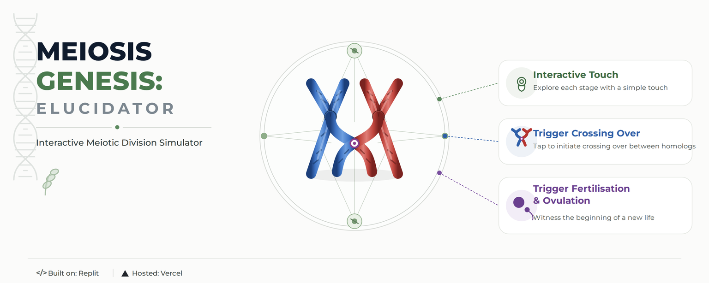

  

# 🧬 Meiosis Genesis: Elucidator

### *Interactive Meiosis Simulator*

> **Meiosis Genesis: Elucidator** is an interactive visualization exploring **meiotic cell division, chromosome behavior, and genetic recombination**.
>
🧬 **Cell Division** · 🧪 **Genetic Recombination** · 🔬 **Chromosome Dynamics**

**🔬 [Explore the Simulation](YOUR-LINK-HERE)**

---

## ✦ Features

**🧬 Interactive Stages**  
Explore the sequential stages of **Meiosis I and Meiosis II**.

**🧪 Chromosome Dynamics**  
Visualize homologous pairing, crossing over, and chromosome segregation.

**🔬 Genetic Recombination**  
Explore the chromosomal basis of genetic variation during meiosis.

**📱 Responsive Design**  
Optimized for modern desktop and mobile devices.

---

## 🧬 Core Concepts

**Meiosis I · Meiosis II · Homologous Chromosomes · Crossing Over · Chromosome Segregation · Genetic Recombination**

---

## ⚙️ Technology

**HTML · CSS · JavaScript**

**Repository:** GitHub & Codeberg  
**Hosting:** Vercel

---

## 📜 License

Distributed under the **GNU General Public License v3.0 (GPL-3.0)**.
